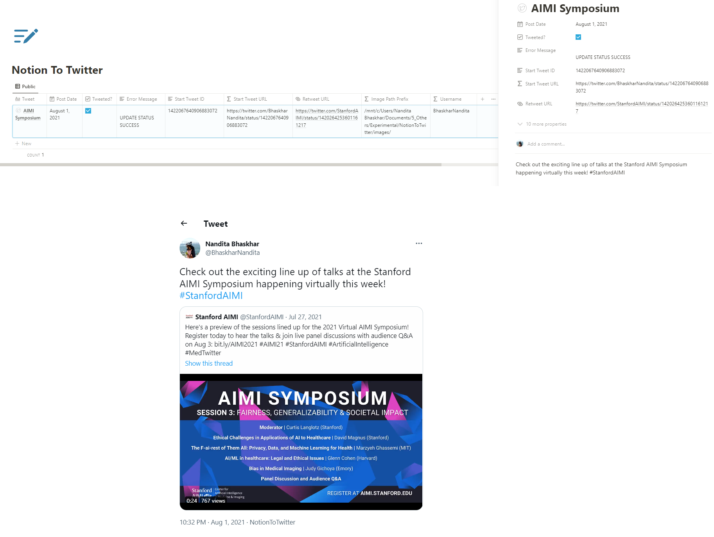

<div align="center">    
 
# NotionToTwitter  


 
</div>
 
## Description   
This project allows you to post newly added threads written in your Notion database (along with the images) directly on to your twitter account via the APIs provided by the two. Update the `Post Date` column in your Notion database to schedule your tweets. You can run the script `scripts/runNotionToTwitter.sh` peridocially at a reasonable frequency via a `crontab` job. 

## Directory Structure

```
.
+-- docs/
|   +-- images/
|   |   +-- demo.png
|   |   +-- icon.png
+-- globalStore/
|   +-- constants.py
+-- lib/
|   +-- port_utils.py
+-- notebooks/
|   +-- trial.py
|   +-- test port_utils.py
+-- scripts/
|   +-- runNotionToTwitter.sh
+-- secrets/
|   +-- secrets_notion.json
|   +-- secrets_twitter.json
+-- src/
|   +-- notionToTwitter.py
+-- .gitignore
+-- juyptext.toml
+-- LICENSE
+-- README.md
+-- requirements.txt
+-- STDOUTlog_examples.txt
```

Additional directory to store images. Make sure to sync it to a cloud service of your choice if you plan to run this codebase on a server (I use Google Drive). You should also add this path to the Notion DB in the `Image Path Prefix` column.
```
path to google drive/My Drive/Notion/TwitterImages
```

---

---

## Usage
1. Register an app on Twitters's developer portal (follow instructions [online](https://developer.twitter.com/en/docs/platform-overview)).
2. Obtain its `APIConsumerKey`, `APIConsumerSecret`, `Bearer Token`, `AccessToken` and `AccessTokenSecret` and add it to `secrets/secrets_twitter.json` in the following format:
```
{
    "APIConsumerKey": "your key here",
    "APIConsumerSecret": "your secret here",
    "BearerToken": "your token here",
    "AccessToken": "your token here",
    "AccessTokenSecret": "your access token here"
}
```
3. Register a private integration on your Notion workspace (follow instructions [online](https://www.notion.so/help/create-integrations-with-the-notion-api#create-an-internal-integration))
4. Obtain its `notionToken`
5. Create a database on Notion to contain all the entries you need to post on Twitter. Make sure it has the following properties. If you want to add more properties or remove, modify the functions and classes in `lib/port_utils.py`.
```
Title property: Tweet
Formula properties: Image Path Prefix, Username, Start Tweet URL
Bool properties: Tweeted?
Date properties: Post Date
Text properties: Error Message, Start Tweet ID
URL properties: Retweet URL
```
- **Note**: The formula for the `Image Path Prefix` property should be `format("path-to-your-local-images-folder")`
- **Note**: The formula for the `Username` property should be `format("your-twitter-username")`
- **Note**: Write your tweet / tweet thread in the page content (row) of the database -- one tweet per block. If you have an image for any of the tweets, just add an `` tag followed by the name of the image. e.g. `tweet text here blah blach image1.png`. (**Untested**: If you want to include multiple images to a single tweet, separate the image names using **;** without any spaces, i.e. `this is my tweet text. Look out for images.image1.png;image2.jpg;image3`). If the first tweet in the thread (or the only tweet in the thread) is a quote retweet, add the URL of the retweet in the property `Retweet URL`.
- **Note**: Only `Tweet`, `Post Date`, `Retweet URL` (optional) and Tweet page contents are to be filled by you. `Image Path Prefix` and `Username` are fixed to the database and the rest of the properties are filled in by the script.
6. Get the `databaseID` and add it to `secrets/secrets_notion.json` in the following format:
```
{
    "notionToken": "your notion token",
    "databaseID": "your notion database ID"
}
```
7. Run the python script `src/notionToTwitter.py` with the correct Twitter username and Notion database (as given in the dictionaries in `globalStore/constants.py`) as command line arguments
8. You can periodically run this file again as a script `scripts/runNotionToTwitter.sh` using a crontab job to get periodic updates (I recommend every day). For more information on Crontab, check out this [reference](https://crontab.guru/).

## Requirements

You can install all the requirements using the following command:

```
pip install -r requirements.txt
pip install -e .
```

## Note

Now that the Twitter API has been announced to no longer be free, there may be changes regarding the number of requests you can make per day. 

## Sources

- [Twitter API Python SDK](https://github.com/geduldig/TwitterAPI)
- [Notion API Python SDK](https://github.com/ramnes/notion-sdk-py)

## If you use it in your work and want to adapt this code, please consider starring this repo or forking from it!

```
@misc{nanbhas2021_notionToTwitter,
  title={Notion To Twitter},
  author={Nandita Bhaskhar},
  howpublished={GitHub Repo, https://github.com/nanbhas/NotionToTwitter},
  year={2021}
}
``` 
 

